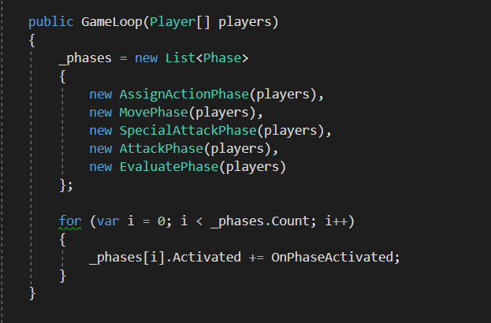

# MadHeroes

Turn-based PvP game (local multiplayer). Time spent on development: 15 hours

[Gameplay video](https://drive.google.com/file/d/1V8b9PvSxtNS8Pb7eNKdv7ew740zqm9sL/view?usp=sharing)

The game supports unlimited number of players and unlimited number of heroes for each player. To add a player just add Player.prefab to your level scene and specify the heroes you want to have in Player.cs attached to the prefab

New heroes and new levels can be added via Game Configuration (Menu: Game -> Configuration)

The game loop can be extended with more phases or reordered in GameLoop.cs

And any hero can be extended with more actions

